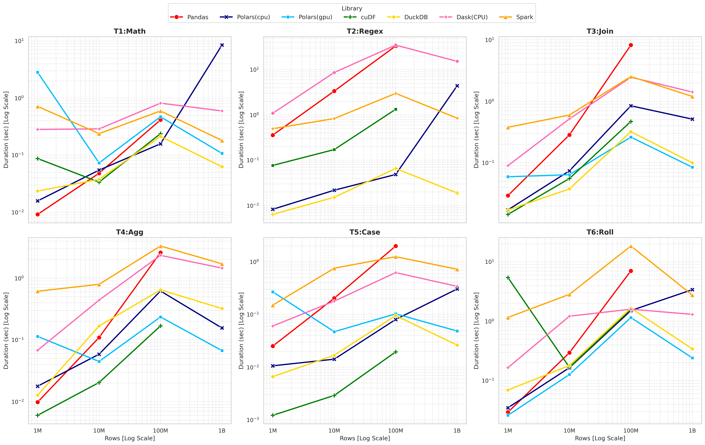

# polars-benchmark
Polars GPU vs データフレームライブラリ性能比較
Qiita記事 https://qiita.com/Isaao/items/cf218ea296f00efb33c1

## 実験環境
DGX Spark [NVIDIAサイト](https://www.nvidia.com/ja-jp/products/workstations/dgx-spark/)
- アーキテクチャ	NVIDIA Grace Blackwell
- CPU	20 コア Arm、10 Cortex-X925 + 10 Cortex-A725 Arm
- GPU	NVIDIA Blackwell アーキテクチャ
- メモリ	128 GB LPDDR5x コヒーレント統合システムメモリ

## ライブラリバージョン
- pandas 2.3.3
- polars 1.36.1

## 結果

